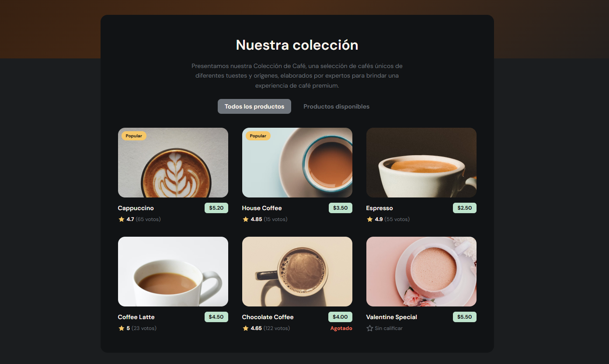

# Cafetería - Reto Frontend

Este proyecto es una aplicación web de listado de cafés, desarrollada con React y Vite.
Muestra una colección de productos con sus precios, calificación y disponibilidad.

---




---

## 🚀 Instrucciones para ejecutar el proyecto

Sigue estos pasos para instalar y correr el proyecto localmente:

1.  **Clona el repositorio** (si aún no lo tienes):
    ```bash
    git clone <https://github.com/ToroDevelloper/Reto-Coffe.git>
    cd Cafeteria
    ```

2.  **Instala las dependencias**:
    ```bash
    npm install
    ```

3.  **Ejecuta el servidor de desarrollo**:
    ```bash
    npm run dev
    ```

4.  Abre tu navegador en la URL que muestra la terminal (usualmente `http://localhost:5173/`).

---

## 👥 Integrantes del equipo

*   [Angel Ivan Toro Caicedo]
*   [Jeferson Andres Jansasoy Muños]

---

## 🛠️ Tecnologías utilizadas

*   React
*   Vite
*   CSS
